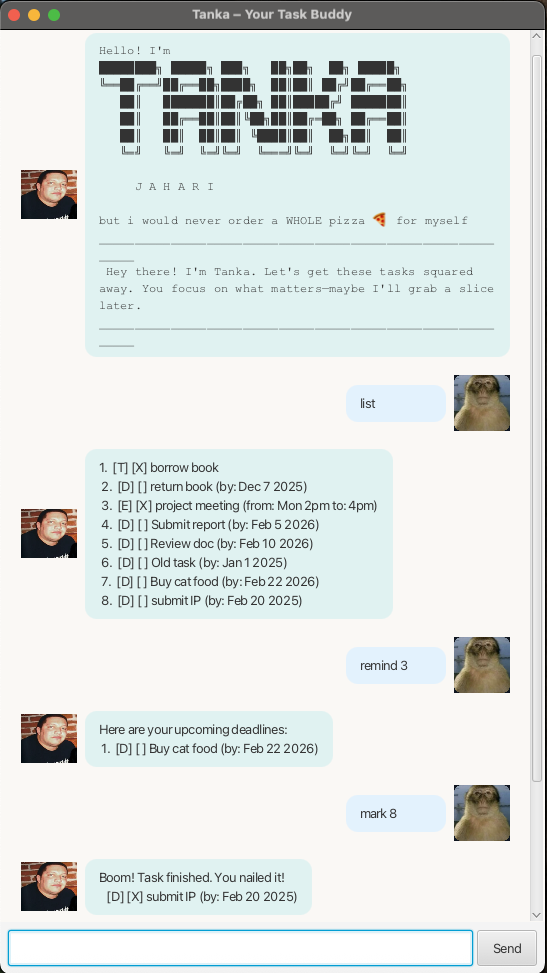

# Tanka User Guide

Tanka is your **chill and reliable task buddy** -- a desktop chatbot that helps you keep track of your todos, deadlines, and events. It uses simple text commands in a friendly chat-style GUI, complete with a laid-back personality and an obsession with pizza. Expect the occasional pizza joke -- Tanka can't help it. Despite the cheesy humour, Tanka takes your tasks seriously and keeps everything organised so you don't have to stress.



## Quick Start

1. Ensure you have **Java 17** or above installed.
2. Download the latest `tanka.jar` from the [Releases](https://github.com/harikrishn4a/ip/releases) page.
3. Copy the file to the folder you want to use as your Tanka home folder.
4. Open a terminal, `cd` into that folder, and run:
   ```
   java -jar tanka.jar
   ```
5. The Tanka window will appear with a welcome message. Type a command in the text box and press **Send** (or Enter) to execute it.

---

## Features

> **Notes about the command format:**
> - Words in `UPPER_CASE` are parameters you supply.
> - Items in square brackets `[...]` are optional.
> - `INDEX` refers to the task number shown by the `list` command (1-based).
> - Dates must be in `yyyy-mm-dd` format (e.g. `2025-03-15`). They are displayed as `MMM d yyyy` (e.g. "Mar 15 2025").
> - Task descriptions **cannot** contain ` | `.
> - Duplicate tasks (same type and description) are rejected.

### Adding a todo: `todo`

Adds a simple task with no date attached.

Format: `todo DESCRIPTION`

Example:

```
todo buy milk
```

Expected output:

```
Gotcha. Another one for the list. No biggie, we'll get through it.
  [T] [ ] buy milk
  Now you have 1 tasks in the list.
```

### Adding a deadline: `deadline`

Adds a task with a due date.

Format: `deadline DESCRIPTION /by DATE`

- `DATE` must be in `yyyy-mm-dd` format.

Example:

```
deadline submit report /by 2025-03-15
```

Expected output:

```
Gotcha. Another one for the list. No biggie, we'll get through it.
  [D] [ ] submit report (by: Mar 15 2025)
  Now you have 2 tasks in the list.
```

### Adding an event: `event`

Adds a task with a start and end time.

Format: `event DESCRIPTION /from START /to END`

- `START` and `END` can be free-text (e.g. `Mon 2pm`) or dates in `yyyy-mm-dd` format.
- If both are valid dates, the start date must be before the end date.

Examples:

```
event team meeting /from Mon 2pm /to Mon 4pm
```

```
event conference /from 2025-06-01 /to 2025-06-03
```

Expected output:

```
Gotcha. Another one for the list. No biggie, we'll get through it.
  [E] [ ] team meeting (from: Mon 2pm to: Mon 4pm)
  Now you have 3 tasks in the list.
```

### Listing all tasks: `list`

Shows all tasks in your list, numbered starting from 1.

Format: `list`

Expected output:

```
1. [T] [X] buy milk
2. [D] [ ] submit report (by: Mar 15 2025)
3. [E] [ ] team meeting (from: Mon 2pm to: Mon 4pm)
```

If the list is empty:

```
You have no tasks in your list.
```

### Marking a task as done: `mark`

Marks the task at the given index as completed. The status icon changes from `[ ]` to `[X]`.

Format: `mark INDEX`

Example:

```
mark 1
```

Expected output:

```
Boom! Task finished. You nailed it!
  [T] [X] buy milk
```

### Marking a task as not done: `unmark`

Marks the task at the given index as not yet completed. The status icon changes from `[X]` back to `[ ]`.

Format: `unmark INDEX`

Example:

```
unmark 1
```

Expected output:

```
OK, I've marked this task as not done yet:
  [T] [ ] buy milk
```

### Deleting a task: `delete`

Removes the task at the given index from the list.

Format: `delete INDEX`

Example:

```
delete 2
```

Expected output:

```
Noted. I've removed this task:
   [D] [ ] submit report (by: Mar 15 2025)
  Now you have 2 tasks in the list.
```

### Finding tasks by keyword: `find`

Searches for tasks whose description contains the given keyword. The search is **case-insensitive**.

Format: `find KEYWORD`

Example:

```
find meeting
```

Expected output:

```
Here are the matching tasks in your list:
1. [E] [ ] team meeting (from: Mon 2pm to: Mon 4pm)
```

If no tasks match:

```
Here are the matching tasks in your list:
  No matching tasks.
```

### Viewing upcoming deadline reminders: `remind`

Shows all **incomplete** deadlines due within the next N days (inclusive of today and the Nth day).

Format: `remind [DAYS]`

- If `DAYS` is omitted, defaults to **7**.
- `DAYS` must be a positive integer.

Examples:

```
remind
```

```
remind 3
```

Expected output:

```
Here are your upcoming deadlines:
1. [D] [ ] submit report (by: Mar 15 2025)
```

If there are no upcoming deadlines:

```
Here are your upcoming deadlines:
  No upcoming deadlines.
```

### Exiting the program: `bye`

Closes the application.

Format: `bye`

---

## Data Storage

Tanka automatically saves your tasks to a file (`data/tasks.txt` relative to the JAR location) after every change. Tasks are loaded automatically when you start the app. There is no need to save manually.

> **Caution:** If you edit the data file manually and introduce an invalid format, Tanka will show an error and start with an empty list.

---

## Command Summary

| Action | Format | Example |
|--------|--------|---------|
| **Todo** | `todo DESCRIPTION` | `todo read book` |
| **Deadline** | `deadline DESCRIPTION /by DATE` | `deadline essay /by 2025-04-01` |
| **Event** | `event DESCRIPTION /from START /to END` | `event meeting /from Mon 2pm /to Mon 4pm` |
| **List** | `list` | `list` |
| **Mark** | `mark INDEX` | `mark 1` |
| **Unmark** | `unmark INDEX` | `unmark 1` |
| **Delete** | `delete INDEX` | `delete 3` |
| **Find** | `find KEYWORD` | `find book` |
| **Remind** | `remind [DAYS]` | `remind 3` |
| **Exit** | `bye` | `bye` |
